# CV Parser - Architecture & Implementation Guide

> **Master Reference Document** - All agent instruction files reference this document as the single source of truth.

## Project Overview

**Name:** CV Parser  
**Type:** Multi-Provider AI Document Processor with Vector Storage  
**Goal:** Parse CVs/Resumes, extract structured data using configurable AI providers (Browser/Ollama/OpenAI), generate embeddings locally or via APIs, and store everything in IndexedDB for fast retrieval and future semantic search.

## Technology Stack

### Frontend
- **Framework:** Angular 17 (Standalone Components)
- **State Management:** RxJS Observables (BehaviorSubjects in services)
- **Modules:** CommonModule, FormsModule
- **Storage:** IndexedDB via `idb` v8.0.0
- **File Parsing:** 
  - PDF: `pdfjs-dist` v5.4.449
  - DOCX: `mammoth` v1.11.0
  - Text: Native FileReader API

### Backend
- **Server:** Node.js + Express
- **Middleware:** CORS, Multer (file uploads), JSON body parser (10MB limit)
- **Endpoints:**
  - `GET /models/*` - Hugging Face proxy for Transformers.js
  - `POST /upload` - File upload handler
  - `POST /extract` - MCP-based extraction

### AI/ML Providers

#### Browser Mode
- **Chat:** WebLLM (`@mlc-ai/web-llm` v0.2.80)
  - Models: Phi-3-mini-4k-instruct, Llama-3-8B-Instruct
  - Quantization: q4f16_1, q4f32_1
  - Requires: WebGPU support (Chrome/Edge 113+)
- **Embeddings:** Transformers.js (`@xenova/transformers` v2.14.0)
  - Models: Xenova/all-MiniLM-L6-v2, Xenova/gte-small
  - Backend proxy: `http://localhost:3000/models/`

#### Ollama Mode
- **API:** Local REST API (default: `http://localhost:11434/api`)
- **Chat & Embeddings:** Both supported
- **Models:** llama3, phi3, mistral, gemma, nomic-embed-text, mxbai-embed-large, all-minilm
- **Features:** Dynamic model library, optional API key authentication

#### OpenAI Mode
- **API:** OpenAI REST API
- **Chat Models:** gpt-4o-mini, gpt-4o, gpt-3.5-turbo
- **Embeddings:** Falls back to Browser/Ollama (not directly supported)
- **Authentication:** API key stored in localStorage

## Architecture

### Frontend Services (`frontend/web/src/app/services/`)

#### 1. ModelRegistryService (`model-registry.service.ts`)
**Role:** Centralized model configuration and state management

**Responsibilities:**
- Provider-specific model catalogs (Browser/Ollama/OpenAI)
- RxJS BehaviorSubjects for reactive state updates
- localStorage persistence for user preferences

**localStorage Keys:**
- `selectedProvider` - 'browser' | 'ollama' | 'openai'
- `selectedEmbeddingModel` - Model ID string
- `selectedChatModel` - Model ID string
- `openaiApiKey` - OpenAI API key
- `ollamaApiUrl` - Custom Ollama URL
- `ollamaApiKey` - Ollama API key

**Key Methods:**
```typescript
setProvider(provider: ModelProvider): void
getCurrentEmbeddingModelId(): string
getCurrentChatModelId(): string
checkBrowserCache(): Promise<{modelId: string, cached: boolean}[]>
updateOllamaModels(): Promise<void>
getOpenAIKey(): string
setOpenAIKey(key: string): void
```

**Observable Streams:**
- `selectedProvider$: Observable<ModelProvider>`
- `chatModels$: Observable<ModelConfig[]>`
- `embeddingModels$: Observable<ModelConfig[]>`

#### 2. OllamaService (`ollama.service.ts`)
**Role:** Ollama API integration and model management

**API Endpoints:**
- `/api/tags` - List installed models
- `/api/pull` - Download models (streaming with multi-layer progress)
- `/api/generate` - Chat completion
- `/api/embeddings` - Generate embeddings

**Critical Method - pullModel:**
```typescript
async pullModel(
  modelName: string, 
  progressCallback: (status: string, completed: number, total: number, digest?: string) => void
): Promise<void>
```

**Progress Callback Parameters:**
- `status` - "pulling" | "verifying" | "writing manifest" | "success"
- `completed` - Bytes downloaded for current layer
- `total` - Total bytes for current layer
- `digest` - Layer identifier (SHA256 hash) - **CRITICAL for multi-layer tracking**

**Configuration:**
```typescript
setApiUrl(url: string): void
setApiKey(key: string): void
isAvailable(): Promise<boolean>
getModels(): Promise<OllamaModel[]>
```

#### 3. OpenAIService (`openai.service.ts`)
**Role:** OpenAI API integration

**Methods:**
```typescript
async generate(
  apiKey: string,
  modelId: string,
  systemPrompt: string,
  userPrompt: string
): Promise<any>
```

**Features:**
- Chat completion via OpenAI API
- JSON response parsing
- Error handling with meaningful messages

#### 4. EmbeddingService (`embedding.service.ts`)
**Role:** Multi-provider embedding generation facade

**Configuration:**
```typescript
import { env } from '@xenova/transformers';
env.allowLocalModels = false;
env.remoteHost = 'http://localhost:3000/models/';
```

**Provider Logic:**
```typescript
async getEmbedding(text: string): Promise<number[]> {
  const provider = this.modelRegistry['selectedProviderSubject'].value;
  
  if (provider === 'ollama') {
    return this.ollamaService.getEmbeddings(modelId, text);
  }
  
  // Browser mode (Transformers.js)
  if (!this.pipe) await this.initModel(modelId);
  const output = await this.pipe(text, { pooling: 'mean', normalize: true });
  return Array.from(output.data);
}
```

**Methods:**
- `initModel(modelId: string): Promise<void>` - Load browser model
- `getEmbedding(text: string): Promise<number[]>` - Generate embedding

#### 5. LocalExtractionService (`local-extraction.service.ts`)
**Role:** Multi-provider chat/extraction facade

**WebLLM Engine Lifecycle:**
```typescript
async initialize(modelId: string, progressCallback?: (text: string) => void) {
  if (this.engine) {
    try {
      // Fast path: reload existing engine
      this.engine.setInitProgressCallback(initProgressCallback);
      await this.engine.reload(modelId);
      return;
    } catch (reloadErr) {
      // Cleanup and recreate
      try { await this.engine.unload(); } catch (e) { }
      this.engine = null;
      // GPU reset delay
      await new Promise(resolve => setTimeout(resolve, 500));
    }
  }
  
  // Create new engine
  this.engine = await CreateMLCEngine(modelId, { initProgressCallback });
}
```

**Provider Delegation:**
```typescript
async extractData(text: string): Promise<any> {
  const provider = this.modelRegistry['selectedProviderSubject'].value;
  
  if (provider === 'ollama') {
    return this.ollamaService.generate(modelId, systemPrompt, userPrompt);
  }
  
  if (provider === 'openai') {
    return this.openAIService.generate(apiKey, modelId, systemPrompt, userPrompt);
  }
  
  // Browser mode (WebLLM)
  const response = await this.engine.chat.completions.create({
    messages: [
      { role: 'system', content: systemPrompt },
      { role: 'user', content: userPrompt }
    ],
    temperature: 0.1
  });
  
  return JSON.parse(response.choices[0].message.content);
}
```

**Extraction Prompt:**
- System: "Extract structured data, return JSON only"
- User: Field specifications + CV text
- Fields: fullName, email, skills, experience, education, certifications
- Temperature: 0.1 (deterministic)

#### 6. StorageService (`storage.service.ts`)
**Role:** IndexedDB CRUD operations

**Schema (version 4):**
```typescript
interface VectorDB extends DBSchema {
  documents: {
    key: string; // requestId
    value: {
      requestId: string;        // UUID v4
      doc_location: string;     // Original filename
      doc_vector: number[];     // Full document embedding
      user_data: any;           // Extracted JSON
      user_data_vector: number[]; // JSON embedding
      fileType: string;         // 'pdf' | 'docx' | 'txt' | 'md' | 'json'
      timestamp: number;        // Date.now()
    };
    indexes: { 'by-timestamp': number };
  };
}
```

**Methods:**
```typescript
async storeDocument(
  requestId: string,
  doc_location: string,
  doc_vector: number[],
  user_data: any,
  user_data_vector: number[],
  fileType: string
): Promise<void>

async getAllDocuments(): Promise<Document[]>
async deleteDocument(requestId: string): Promise<void>
async importDocuments(documents: Document[]): Promise<void>
```

**Upgrade Strategy:**
```typescript
openDB<VectorDB>('ai-vector-db', 4, {
  upgrade(db, oldVersion, newVersion, transaction) {
    // Drop and recreate (data loss acceptable for demo)
    if (db.objectStoreNames.contains('documents')) {
      db.deleteObjectStore('documents');
    }
    const store = db.createObjectStore('documents', { keyPath: 'requestId' });
    store.createIndex('by-timestamp', 'timestamp');
  }
});
```

#### 8. ModelRegistry Service (`model-registry.service.ts`) - OpenAI Metadata

**Dynamic Metadata Fetching:**
```typescript
// New methods for OpenAI model metadata
async fetchOpenAIMetadata(): Promise<any>   // GET from backend
async refreshOpenAIMetadata(): Promise<any> // POST refresh trigger
private cachedOpenAIMetadata: any          // Local cache
```

**Metadata Application:**
- Fuzzy matching for model IDs (handles versioned names like "gpt-4o-2024-05-13")
- Injects contextLength, outputTokens, knowledgeCutoff into model configs
- Falls back to defaults if backend unavailable

#### 7. FileParsingService (`file-parsing.service.ts`)
**Role:** Multi-format file parsing

**Supported Formats:** PDF, DOCX, DOC, TXT, MD, JSON

**Methods:**
```typescript
async parseFile(file: File): Promise<string>
private async parsePdf(file: File): Promise<string>
private async parseDocx(file: File): Promise<string>
private readTextFile(file: File): Promise<string>
```

**PDF.js Configuration:**
```typescript
import * as pdfjsLib from 'pdfjs-dist';
pdfjsLib.GlobalWorkerOptions.workerSrc = './assets/pdf.worker.min.mjs';
```

### Frontend Component (`frontend/web/src/app/app.component.ts`)

#### AppComponent
**Role:** Main orchestrator, UI controller, state manager

**Key State:**
```typescript
documents: any[] = [];                    // In-memory document cache
steps: ProgressStep[] = [];               // Pipeline step tracking
progressPercent: number = 0;              // Global progress (0-100)
selectedProvider: ModelProvider;          // Active provider
isPullingEmbedding: boolean = false;      // Download state
isPullingChat: boolean = false;
embeddingPullProgress: ProgressObject;    // Multi-layer tracking
chatPullProgress: ProgressObject;
```

**Automated Pipeline (onFileSelected):**
1. **Parse File** - Extract text via FileParsingService
2. **Load Models** - Initialize chat + embedding models (if needed)
3. **Extract Data** - Call LocalExtractionService with CV text
4. **Generate Doc Vector** - Embed full document text
5. **Generate Data Vector** - Embed extracted JSON string
6. **Store** - Save to IndexedDB via StorageService

**Progress Tracking:**
```typescript
interface ProgressStep {
  name: string;
  status: 'pending' | 'loading' | 'completed' | 'error';
}

steps = [
  { name: 'Parsing File', status: 'pending' },
  { name: 'Loading Models', status: 'pending' },
  { name: 'Extracting Structured Data', status: 'pending' },
  { name: 'Generating Document Vector', status: 'pending' },
  { name: 'Generating Data Vector', status: 'pending' },
  { name: 'Storing in Database', status: 'pending' }
];
```

**Status Icons:**
- ○ Pending (gray)
- ⏳ Loading (animated)
- ✓ Completed (green)
- ✗ Error (red)

### Backend (`backend/`)

#### Express Server (`server.js`)

**Endpoints:**

1. **Model Proxy** - `GET /models/*`
   - Proxies Hugging Face requests for Transformers.js
   - Adds Authorization header with HF API token
   - Streams response with preserved headers
   - Purpose: Bypass CORS and authentication requirements

2. **File Upload** - `POST /upload`
   - Uses Multer disk storage
   - Saves to `uploads/` directory
   - Filename: `{timestamp}-{originalname}`
   - Returns: `{ filename, path, originalname }`

3. **Extraction** - `POST /extract`
   - Body: `{ text: string }`
   - Delegates to MCP server
   - Returns: Extracted JSON or `{ error }`

**Configuration:**
```javascript
app.use(cors());
app.use(express.json({ limit: '10mb' }));

const storage = multer.diskStorage({
  destination: 'uploads/',
  filename: (req, file, cb) => {
    cb(null, Date.now() + '-' + file.originalname);
  }
});
```

4. **Model Metadata** - `GET /api/model-metadata`
   - Returns cached OpenAI model specifications
   - Reads from `models-metadata.json`
   - Fast lookup for frontend modal

5. **Model Metadata Refresh** - `POST /api/model-metadata/refresh`
   - Triggers immediate metadata update
   - Rate limited: 5 minute cooldown
   - Updates `models-metadata.json`
   - Returns fresh data with timestamp

**Scheduled Jobs:**
```javascript
// Daily metadata refresh at 3 AM
cron.schedule('0 3 * * *', async () => {
  await fetchAndUpdateModelMetadata();
});
```

#### Metadata Fetcher (`utils/model-metadata-fetcher.js`)

**Function:** `fetchAndUpdateModelMetadata()`
- Updates JSON with latest OpenAI model specs
- Currently uses verified Nov 2024 data
- Ready for web scraping integration
- Logs success/failure to console

**Storage Format:**
```json
{
  "lastUpdated": "2025-12-05T15:06:50.530Z",
  "models": {
    "gpt-4o": {
      "contextLength": "128k",
      "outputTokens": "16k",
      "knowledgeCutoff": "Oct 2023",
      "details": "High Intelligence"
    }
  }
}
```

**Metadata System Architecture:**

```mermaid
sequenceDiagram
    participant Cron as Scheduled Job<br/>(Daily 3 AM)
    participant Fetcher as Metadata Fetcher
    participant JSON as models-metadata.json
    participant API as Backend API
    participant Frontend as ModelRegistryService
    participant Modal as Model Info Modal

    Note over Cron,JSON: Automated Updates
    Cron->>Fetcher: Trigger daily refresh
    Fetcher->>Fetcher: Fetch latest specs
    Fetcher->>JSON: Write updated metadata
    
    Note over Frontend,Modal: On-Demand Fetch
    Frontend->>API: GET /api/model-metadata
    API->>JSON: Read cached data
    API-->>Frontend: Return {lastUpdated, models}
    Frontend->>Frontend: Cache in memory
    
    Note over Modal,JSON: Manual Refresh
    Modal->>Frontend: User clicks 🔄
    Frontend->>API: POST /api/model-metadata/refresh
    API->>API: Check rate limit (5 min)
    API->>Fetcher: Trigger immediate refresh
    Fetcher->>JSON: Update metadata
    API-->>Frontend: Return fresh data + timestamp
    Frontend->>Frontend: Update cache
    Modal->>Modal: Display ⏳ → Show updated data
```



**Data Flow Diagram:**

```mermaid
graph TB
    subgraph Backend
        Cron[Scheduled Job<br/>node-cron]
        Fetcher[Metadata Fetcher<br/>fetchAndUpdateModelMetadata]
        JSON[models-metadata.json<br/>JSON Storage]
        GetAPI[GET /api/model-metadata<br/>Fast Cached Read]
        PostAPI[POST /api/model-metadata/refresh<br/>Manual Trigger + Rate Limit]
    end
    
    subgraph Frontend
        Service[ModelRegistryService<br/>fetchOpenAIMetadata<br/>refreshOpenAIMetadata]
        Cache[cachedOpenAIMetadata<br/>In-Memory Cache]
        Component[AppComponent<br/>refreshModelMetadata]
        Modal[Model Info Modal<br/>🔄 Refresh Button]
    end
    
    Cron -->|Daily 3 AM| Fetcher
    Fetcher -->|Write| JSON
    GetAPI -->|Read| JSON
    PostAPI -->|Trigger| Fetcher
    
    Service -->|HTTP GET| GetAPI
    GetAPI -->|JSON Response| Service
    Service -->|Store| Cache
    
    Modal -->|Click 🔄| Component
    Component -->|Call| Service
    Service -->|HTTP POST| PostAPI
    PostAPI -->|Fresh Data| Service
    Service -->|Update| Cache
    Cache -->|Display| Modal
    
    style Cron fill:#90EE90
    style JSON fill:#FFD700
    style Modal fill:#87CEEB
    style Cache fill:#FFA500
```



#### MCP Server (`mcp-server.js`)

**Tool:** `extract_cv_data`

**LLM Configuration:**
- Model: OpenAI gpt-4o-mini
- Temperature: 0.1 (deterministic)
- Max input: 10,000 characters (truncated)

**Prompt:**
```
Extract the following fields from the resume text below and return ONLY a valid JSON object.
Fields: fullName, email, skills (array), experience (array of objects with title, company, dates), education (array), certifications (array).

If a field is not found, use null or empty array.
Do not include markdown formatting like ```json. Just the raw JSON.

Resume Text:
{text}
```

**Response Cleaning:**
```javascript
let generatedText = result.choices[0].message.content;
generatedText = generatedText.replace(/```json/g, '').replace(/```/g, '').trim();

try {
  return JSON.parse(generatedText);
} catch (e) {
  return { raw_text: generatedText, error: "Failed to parse JSON response" };
}
```

## Critical Implementation Patterns

### 1. Multi-Layer Progress Tracking (Ollama Downloads)

**Problem:** Ollama downloads models in multiple layers (blobs). Each layer has its own progress stream that resets from 0-100%. Naively displaying `completed/total` causes progress bar jumping.

**Solution:** Track progress per `digest` (layer identifier) and aggregate:

```typescript
// In AppComponent.downloadEmbeddingModel() or downloadChatModel()
const digestProgress = new Map<string, number>();

await this.ollamaService.pullModel(modelId, 
  (status, completed, total, digest) => {
    if (digest) {
      // Store cumulative progress for this specific layer
      digestProgress.set(digest, completed);
    }
    
    // Calculate total progress across all layers
    const totalDownloaded = Array.from(digestProgress.values())
      .reduce((sum, val) => sum + val, 0);
    
    // Total size = current layer total * number of unique digests seen
    const totalSize = total * digestProgress.size;
    
    // Calculate percentage, capped at 100
    const percent = totalSize > 0 
      ? Math.min(100, Math.round((totalDownloaded / totalSize) * 100))
      : 0;
    
    // Update progress object
    this.embeddingPullProgress.percent = percent;
    this.embeddingPullProgress.status = status || 'Downloading...';
    
    // Handle special statuses
    if (status === 'verifying' || status === 'writing manifest') {
      this.embeddingPullProgress.percent = 100;
    }
  }
);
```

**Status Handling:**
- `"pulling"` - Normal download, show calculated progress
- `"verifying"` - Force 100% (total may be undefined)
- `"writing manifest"` - Force 100%
- `"success"` - Complete, hide progress UI

**Critical Requirements:**
- `OllamaService.pullModel()` MUST pass `digest` to callback
- Maintain `Map<string, number>` for layer tracking
- Handle undefined `total` during verification phase

### 2. WebLLM Engine Lifecycle Management

**Challenge:** GPU state persistence, model switching, error recovery

**Best Practices:**
1. Always try `reload()` before creating new engine (faster)
2. Catch reload errors separately from creation errors
3. Add 500ms delay after `unload()` before creating new engine
4. Nullify engine reference after unload
5. Wire progress callbacks for UI feedback

**Pattern:**
```typescript
if (this.engine) {
  try {
    // Fast path: reload existing engine
    this.engine.setInitProgressCallback(initProgressCallback);
    await this.engine.reload(modelId);
    return;
  } catch (reloadErr) {
    // Reload failed, clean up properly
    console.warn('Reload failed, recreating engine:', reloadErr);
    try { await this.engine.unload(); } catch (e) { }
    this.engine = null;
    // Give GPU time to reset
    await new Promise(resolve => setTimeout(resolve, 500));
  }
}

if (!this.engine) {
  // Create new engine with progress callbacks
  this.engine = await CreateMLCEngine(modelId, { initProgressCallback });
}
```

### 3. Multi-Provider Delegation Pattern

**Services act as facades that delegate to the correct provider:**

```typescript
async getEmbedding(text: string): Promise<number[]> {
  const provider = this.modelRegistry['selectedProviderSubject'].value;
  
  if (provider === 'ollama') {
    const modelId = this.modelRegistry.getCurrentEmbeddingModelId();
    return this.ollamaService.getEmbeddings(modelId, text);
  }
  
  if (provider === 'browser') {
    if (!this.pipe) {
      const modelId = this.modelRegistry.getCurrentEmbeddingModelId();
      await this.initModel(modelId);
    }
    const output = await this.pipe(text, { pooling: 'mean', normalize: true });
    return Array.from(output.data);
  }
  
  throw new Error(`Embeddings not supported for provider: ${provider}`);
}
```

**Key Points:**
- Check `ModelRegistryService.selectedProvider$` to determine active provider
- Use if/else or switch/case for provider-specific logic
- Always handle all three providers (Browser/Ollama/OpenAI)
- Provide meaningful error messages for unsupported operations

### 4. IndexedDB Schema Upgrades

**Current Approach (v4):**
```typescript
openDB<VectorDB>('ai-vector-db', 4, {
  upgrade(db, oldVersion, newVersion, transaction) {
    // Nuclear option: drop and recreate
    if (db.objectStoreNames.contains('documents')) {
      db.deleteObjectStore('documents');
    }
    
    const store = db.createObjectStore('documents', { keyPath: 'requestId' });
    store.createIndex('by-timestamp', 'timestamp');
  }
});
```

**Trade-offs:**
- **Pro:** Simple, ensures schema consistency
- **Con:** Data loss on every version upgrade
- **Status:** Acceptable for demo/dev phase
- **Future:** Implement data migration logic before production

### 5. Transformers.js Backend Proxy

**Purpose:** Bypass CORS restrictions and add Hugging Face authentication

**Frontend Configuration:**
```typescript
import { env } from '@xenova/transformers';
env.allowLocalModels = false;
env.remoteHost = 'http://localhost:3000/models/';
```

**Backend Proxy:**
```javascript
app.get('/models/*', async (req, res) => {
  const modelPath = req.params[0];
  const hfUrl = `https://huggingface.co/${modelPath}`;
  
  const response = await fetch(hfUrl, {
    headers: {
      'Authorization': `Bearer ${HF_API_KEY}`
    }
  });
  
  // Forward headers
  const headersToForward = ['content-type', 'content-length', 'last-modified', 'etag'];
  response.headers.forEach((value, key) => {
    if (headersToForward.includes(key.toLowerCase())) {
      res.setHeader(key, value);
    }
  });
  
  // Stream response
  response.body.pipe(res);
});
```

**Request Flow:**
1. Transformers.js: `/Xenova/all-MiniLM-L6-v2/resolve/main/tokenizer.json`
2. Backend proxies to: `https://huggingface.co/Xenova/all-MiniLM-L6-v2/resolve/main/tokenizer.json`
3. Backend adds: `Authorization: Bearer <token>`
4. Response streamed back to client

## UI/UX Standards

### Color Palette
- **Primary:** #007bff (Blue)
- **Success:** #28a745 (Green)
- **Danger:** #dc3545 (Red)
- **Secondary:** #6c757d (Gray)
- **Info:** #17a2b8 (Cyan)
- **Purple:** #6f42c1 (Markdown)

### File Type Colors
- **PDF:** #dc3545 (Red)
- **DOCX:** #007bff (Blue)
- **TXT:** #6c757d (Gray)
- **MD:** #6f42c1 (Purple)
- **JSON:** #28a745 (Green)

### Layout
- **Container:** Max-width 800px, centered, 20px padding
- **Border Radius:** 4-8px for cards/inputs
- **Transitions:** 0.3s ease for smooth animations
- **Typography:** Sans-serif, responsive font sizes

### Provider Tabs
- Browser (Beta) - Client-side, requires WebGPU
- Ollama (Local) - Local server, requires `ollama serve`
- OpenAI (Cloud) - API key required

### Model Grouping
- **Installed Models (Ready)** - Available immediately
- **Available to Download** - Requires download first

## Development Workflow

### Commands
```bash
# Frontend (port 4200)
cd frontend/web
npm install
npm start

# Backend (port 3000)
cd backend
npm install
npm start

# Ollama (required for Ollama mode)
ollama serve
```

### Testing Scenarios
1. **Browser Mode:** Upload CV, observe WebLLM download progress, verify IndexedDB storage
2. **Ollama Mode:** Start Ollama, refresh library, download model, upload CV
3. **OpenAI Mode:** Enter API key, select model, upload CV, verify extraction quality
4. **Export/Import:** Export database, clear IndexedDB (DevTools), import, verify restoration
5. **Error Handling:** Stop Ollama mid-process, observe error status, retry

### Debugging Tools

**Browser DevTools:**
- **Application → IndexedDB:** Inspect `ai-vector-db`, verify schema version and data
- **Network:** Monitor Ollama/OpenAI API calls, check for errors
- **Console:** Filter by service name (e.g., "OllamaService")
- **Performance:** Profile model loading, identify bottlenecks

**Ollama CLI:**
```bash
# Check if running
curl http://localhost:11434/api/tags

# List models
ollama list

# Test generation
ollama run llama3:8b "Hello"
```

## Common Tasks

### Adding New AI Provider

1. **Create Service** (e.g., `anthropic.service.ts`)
```typescript
@Injectable({ providedIn: 'root' })
export class AnthropicService {
  async generate(apiKey: string, modelId: string, prompt: string): Promise<any> {
    // Implementation
  }
  
  async getEmbeddings(apiKey: string, modelId: string, text: string): Promise<number[]> {
    // Implementation
  }
}
```

2. **Update ModelRegistryService**
```typescript
export type ModelProvider = 'browser' | 'ollama' | 'openai' | 'anthropic';

private readonly anthropicChatModels: ModelConfig[] = [
  { id: 'claude-3-sonnet', name: 'Claude 3 Sonnet', type: 'chat', provider: 'anthropic' }
];
```

3. **Update EmbeddingService**
```typescript
if (provider === 'anthropic') {
  return this.anthropicService.getEmbeddings(apiKey, modelId, text);
}
```

4. **Update LocalExtractionService**
```typescript
if (provider === 'anthropic') {
  return this.anthropicService.generate(apiKey, modelId, prompt);
}
```

5. **Add UI Tab** in `AppComponent` template
```html
<button (click)="onProviderChange('anthropic')">Anthropic</button>
```

6. **Add Configuration Inputs**
```html
<input type="password" [(ngModel)]="anthropicApiKey" placeholder="API Key">
<button (click)="saveAnthropicKey()">Save</button>
```

### Adding New File Format

1. **Update FileParsingService**
```typescript
async parseFile(file: File): Promise<string> {
  const extension = file.name.split('.').pop()?.toLowerCase();
  
  switch (extension) {
    case 'rtf':
      return this.parseRtf(file);
    // ... existing cases
  }
}

private async parseRtf(file: File): Promise<string> {
  // Implementation using rtf-parser library
}
```

2. **Update Color Mapping**
```typescript
getFileColor(fileType: string): string {
  const colors: { [key: string]: string } = {
    'rtf': '#ff6600',  // Orange
    // ... existing colors
  };
  return colors[fileType] || '#6c757d';
}
```

3. **Update File Input**
```html
<input type="file" accept=".txt,.md,.json,.pdf,.docx,.doc,.rtf">
```

### Modifying Extraction Schema

1. **Update Prompt** in `LocalExtractionService.getSystemPrompt()`
```typescript
private getSystemPrompt(): string {
  return `Extract structured data and return JSON with these fields:
    - fullName (string)
    - email (string)
    - phone (string)  // NEW
    - location (string)  // NEW
    - skills (array)
    - experience (array)
    - education (array)
    - certifications (array)
  `;
}
```

2. **Update UI Template** in `AppComponent`
```html
<div>
  <label>Phone:</label>
  <input [value]="doc.user_data?.phone" readonly>
</div>
```

3. **Consider Schema Versioning** if structure changes significantly
```typescript
// Bump version if adding required fields
openDB<VectorDB>('ai-vector-db', 5, {
  upgrade(db, oldVersion, newVersion, transaction) {
    // Migration logic
  }
});
```

## Error Handling

### Provider-Specific Errors

**Ollama:**
- Connection refused → Check if `ollama serve` is running
- Model not found → Verify model is installed with `ollama list`
- Timeout → Increase timeout, check model size

**Browser:**
- WebGPU unavailable → Check browser compatibility (Chrome/Edge 113+)
- Model download failed → Check network, clear IndexedDB cache
- Out of memory → Use smaller model, close other tabs

**OpenAI:**
- API key invalid → Verify key in settings, check OpenAI dashboard
- Rate limit exceeded → Wait and retry, upgrade plan
- Model not available → Check model name, verify subscription

### UI Error Patterns

**Step-Level Errors:**
```typescript
try {
  this.updateStepStatus('Parsing File', 'loading');
  const text = await this.fileParsingService.parseFile(file);
  this.updateStepStatus('Parsing File', 'completed');
} catch (err) {
  this.updateStepStatus('Parsing File', 'error');
  console.error('Parsing failed:', err);
  // Don't throw, let user retry
  return;
}
```

**User-Friendly Messages:**
- "Failed to parse PDF. Please ensure the file is not corrupted."
- "Ollama connection failed. Ensure Ollama is running with 'ollama serve'."
- "Model download interrupted. Click 'Download' to retry."

## Security Considerations

### API Keys
- Stored in localStorage (user responsibility)
- Never logged or transmitted except to configured APIs
- Recommend environment variables for backend keys

### Data Isolation
- IndexedDB sandboxed per origin
- No cross-origin data access
- User controls all data (export/import/delete)

### Network Security
- Backend HF API key should use environment variable (currently hardcoded)
- CORS enabled only for localhost (production should restrict)
- No telemetry or external tracking

### Best Practices
- Never commit API keys to repository
- Use .env files for backend configuration
- Implement rate limiting on backend endpoints
- Add request validation and sanitization

## Known Limitations

1. **Single File Upload:** Must process files sequentially (no batch upload yet)
2. **No Search UI:** Vector storage ready, but semantic search interface not implemented
3. **Memory Usage:** Large models (4GB+) may cause issues on low-memory devices
4. **Browser Compatibility:** WebGPU required for browser mode (Chrome/Edge 113+ only)
5. **Data Migration:** Schema upgrades currently drop all data (temporary limitation)
6. **Extraction Quality:** Depends on model quality and prompt engineering
7. **File Size Limits:** Large PDFs (>50MB) may cause parsing issues
8. **Concurrent Processing:** No parallel file processing support

## Future Roadmap

### Phase 1 (Current)
- ✅ Multi-provider architecture
- ✅ File parsing (PDF, DOCX, TXT, MD, JSON)
- ✅ Vector generation and storage
- ✅ Export/Import functionality

### Phase 2 (Planned)
- Semantic search UI with similarity ranking
- Batch file upload and processing
- Job description matching interface
- Advanced filtering (experience, skills, location)

### Phase 3 (Future)
- Comparison view (side-by-side candidates)
- PDF export of candidate summaries
- Real-time collaboration features
- ATS integration plugins

### Phase 4 (Vision)
- Custom extraction templates
- Multi-language support
- Resume generation tools
- Interview scheduling integration
